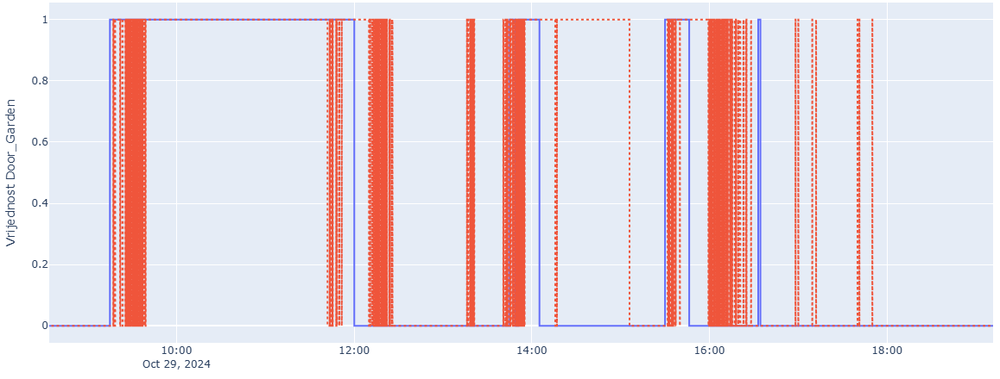
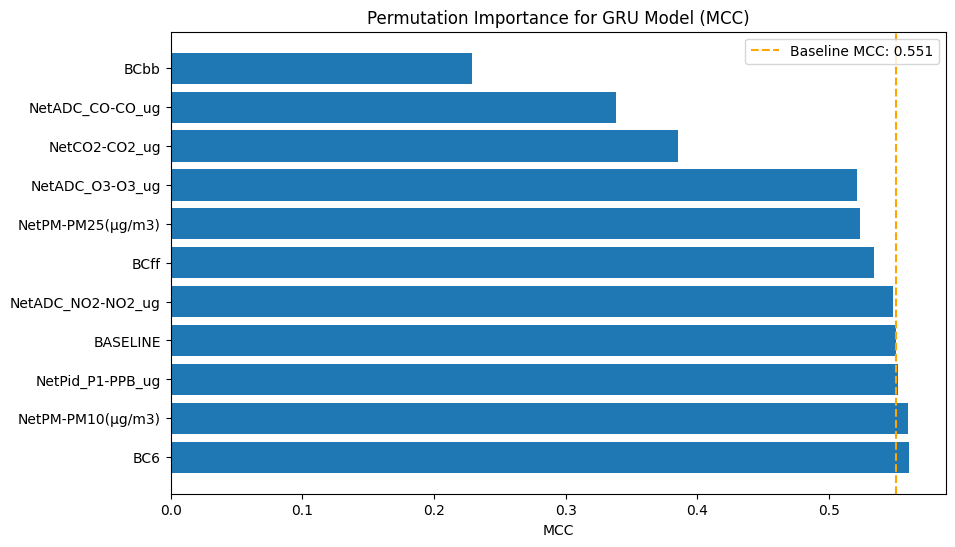

# Time Series Analysis for Indoor Air Quality Assessment

This repository contains the code and resources for the master's thesis project, "Time Series Analysis for Indoor Air Quality Assessment." The project focuses on the automatic detection of specific events, including door openings, human presence, and combustion, by analyzing time series data from indoor air quality (IAQ) sensors.

This research is proudly part of the **EDIAQI (Evidence Driven Indoor Air Quality Improvement)** project, a Horizon Europe initiative dedicated to understanding and mitigating indoor air pollution. The findings and methodologies developed in this thesis are detailed in a forthcoming scientific publication.

## Key Features

*   **Event Detection from IAQ Data:** Development and evaluation of machine learning models to detect events like door openings, human presence, and combustion solely from sensor data.
*   **Advanced Time Series Analysis:** Application of Recurrent Neural Networks (RNNs) with Gated Recurrent Units (GRU) to capture temporal dependencies in IAQ data.
*   **Focus on Non Standard Parameters:** Investigation into the predictive power of less conventional IAQ parameters such as Total Volatile Organic Compounds (TVOC), Carbon Monoxide (CO), and Black Carbon (BC).
*   **Comprehensive Methodology:** A complete pipeline from data preprocessing and integration of heterogeneous sensor sources to model training, evaluation, and interpretation.
*   **Explainable AI (XAI):** Utilization of techniques like permutation feature importance to understand the key drivers behind model predictions.

## Models and Results

Three distinct classification models were developed, each targeting a specific event. The models were built using GRU networks and evaluated with the Matthews Correlation Coefficient (MCC) to account for significant class imbalance.

### 1. Door Opening Detection

This model achieved high reliability in detecting the opening of a garden door.

*   **MCC:** ≈ 0.78
*   **Key Predictors:** Total Volatile Organic Compounds (TVOC) and Carbon Monoxide (CO).
*   **Insight:** The model successfully learned the "chemical signature" of air exchange with the outdoors, demonstrating that changes in chemical composition can be a more robust indicator than temperature or humidity.


*Figure 1: Comparison of actual (blue) and predicted (red) door opening events.*

### 2. Human Presence Detection

Detecting human presence proved to be a more challenging task, yet the model yielded valuable insights.

*   **MCC:** ≈ 0.38
*   **Key Predictor:** Carbon Monoxide (CO).
*   **Insight:** Unexpectedly, CO was a more dominant predictor than the traditional CO2. This suggests the model identified activities associated with human presence (e.g., use of certain appliances) rather than just respiration.

### 3. Combustion Detection

The model for detecting combustion events, such as the use of a gas stove or lighting a candle, produced solid results.

*   **MCC:** ≈ 0.54
*   **Key Predictors:** Black Carbon (BCbb biomass burning), Carbon Monoxide (CO), and Carbon Dioxide (CO2).
*   **Insight:** The model effectively learned to distinguish between different combustion sources by leveraging specific BC components and gas concentrations.


*Figure 2: Analysis of feature importance for the combustion detection model. (Lower MCC = more important)*

## Data

The dataset was collected in a real world residential environment and includes:

*   **Main IAQ Sensor Data:** High resolution data on CO2, O3, CO, PM10, PM2.5, TVOC, and NO2.
*   **Contextual Sensors:** Binary sensors for door status (open/closed) and motion detectors.
*   **Black Carbon Instrument:** Specialized measurements of different black carbon components (BCbb, BCff, BC6).
*   **Experiment Logs:** A structured JSON file detailing the start and end times of all controlled experiments and activities.

A crucial part of the methodology was the careful preprocessing of data to create a "clean" baseline state for each event, allowing the models to learn specific and unambiguous "chemical signatures."

## Methodology

The project followed a structured machine learning workflow:

1.  **Data Integration and Preprocessing:** Merging data from multiple sources, aligning time series, and handling missing values.
2.  **Feature Engineering:** Selecting relevant IAQ parameters and creating target variables from event logs.
3.  **Model Training:** Implementing GRU based neural networks for time series classification.
4.  **Model Evaluation:** Using time series cross validation and the MCC metric to assess performance on unbalanced data.
5.  **Model Interpretation:** Applying XAI techniques to identify the most influential features for each detection task.

## Getting Started

To get a local copy up and running, follow these simple steps.

### Prerequisites

*   Python 3.8+
*   pip

### Installation

1.  Clone the repo
    ```sh
    git clone https://github.com/your_username/AirQualityDetection.git
    ```
2.  Navigate to the project directory
    ```sh
    cd AirQualityDetection
    ```
3.  Install the required packages
    ```sh
    pip install -r requirements.txt
    ```
4.  Explore the Jupyter notebooks in the `notebooks/` directory to see the data analysis, model training, and evaluation process.